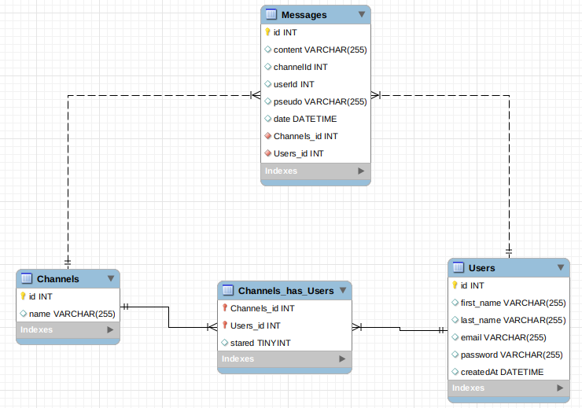

# JSF_irc_2019

Création d'un server IRC en NodeJs, ExpressJS avec un client angular

### Fonctionnalitées implémentées : 
* Se connecter / déconnecter de l'application
* S'inscrire sur l'application
* Créer un nouveau channel
* rechercher un channel et le rejoindre
* rejoindre et quitter un channel
* Notification dans un channel lorsqu'un utilisateur rejoint ou quitte le channel
* Notification dans un channel lorsqu'un utilisateur change de pseudo 
* Possiblité de changer son pseudo
* Renommer un channel
* Ajouter un channel à ses favoris
* Envoyer un message broadcaster à tous les utilisateurs
* Persistance des données 
* Afficher le nombre d'utilisateurs connectés à un channel


### Requirments

* Docker
* NodeJs
* NPM
 

### Technologies

* [AngularJS](https://angular.io/) - Power the front of the application
* [Bootstrap](https://mdbootstrap.com/) - Improve the UI/UX
* [node.js](https://nodejs.org/) - evented I/O for the backend
* [Express](https://expressjs.com/) - fast node.js network app framework
* [MySql]() - Database system for data persistance

### Database


| Commands                                                    | Description                 |
|-------------------------------------------------------------|-----------------------------|
| Image                                                       | mysql:5.7                   |
| Database name                                               | irc                         |
| Ports                                                       | 3306                        |
| [Volume](./backend/database/dbirc)                          | dbirc                       |
| [docker-compose.yml](./backend/database/docker-compose.yml) | Fichiers de configuration   |


### Front end
> #### Arboresence


### Installation
```sh
$ git clone git@gitlab.com:baronbrn/jsf_irc_2019.git
$ cd jsf_irc_2019/
$ ./init.sh
```
> Now you can go to 127.0.0.1:4200
### Stop the application
```sh
$ cd backend
$ npm stop
$ cd ../
$ ./script_front/stop_server.sh
```
